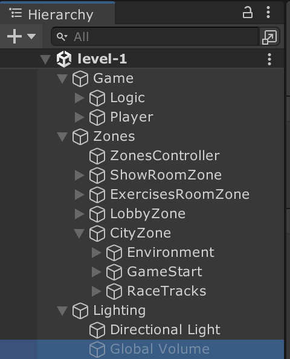
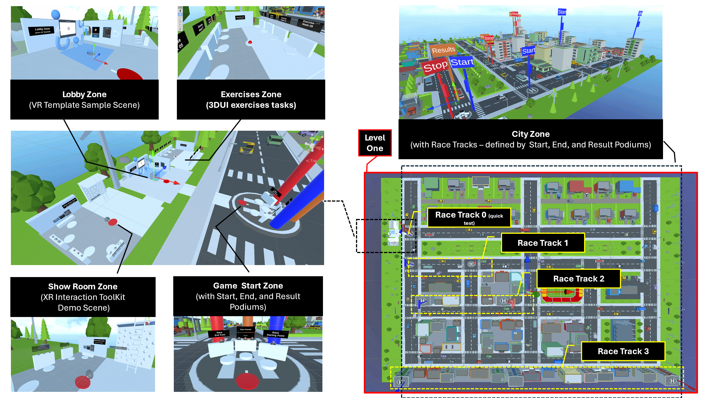
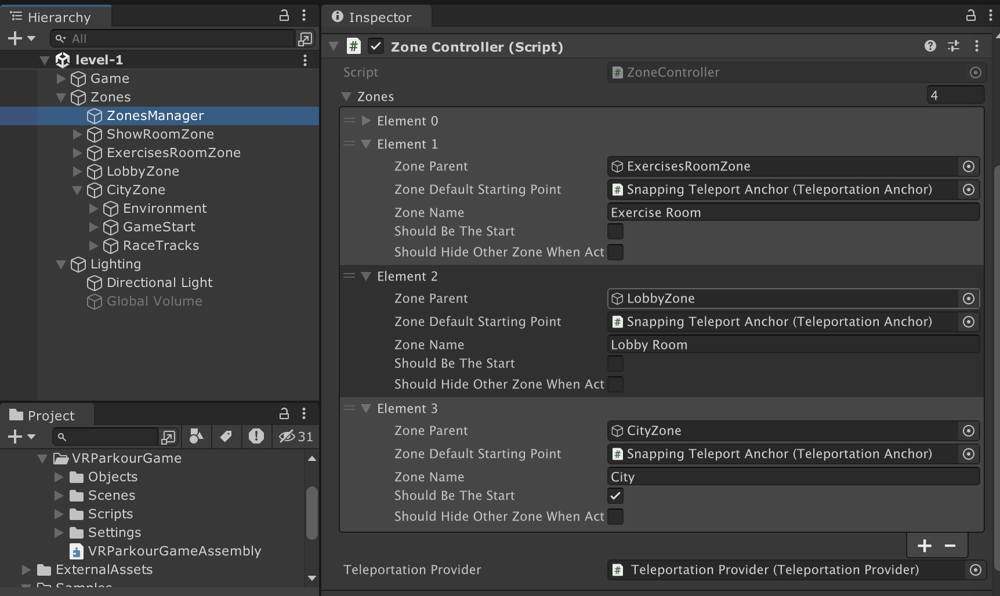
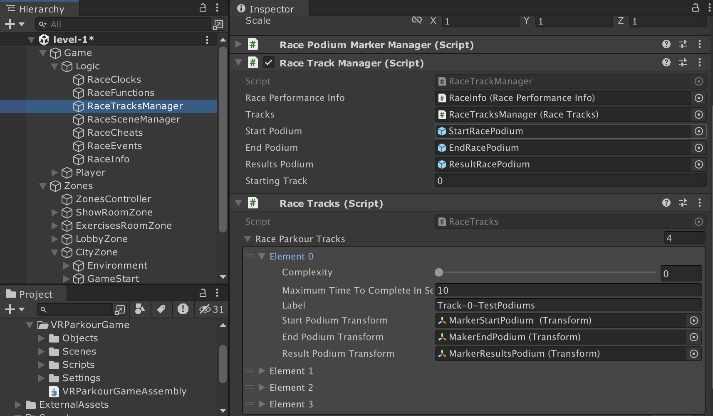
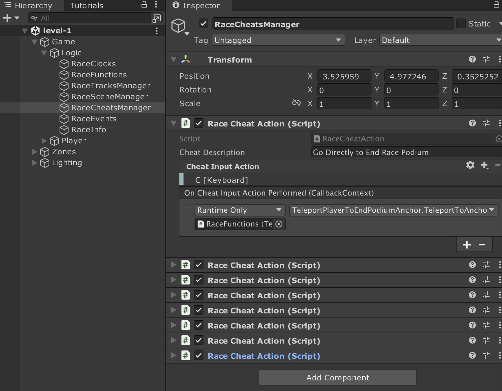
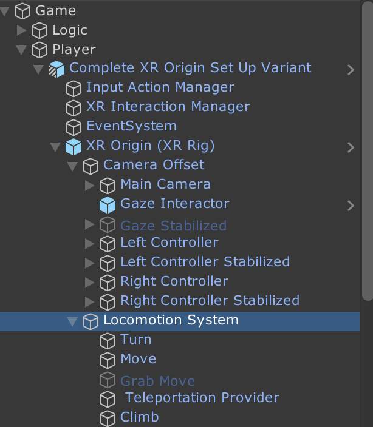
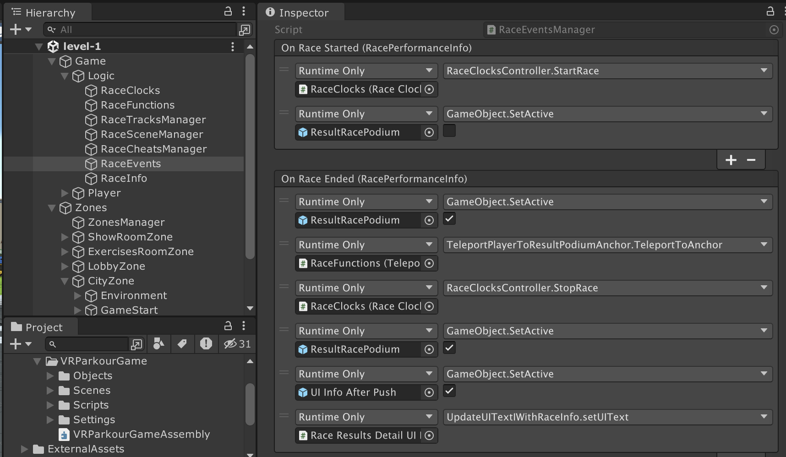

Welcome to our VR Parkour Game! 
We’re a team from the IT Master program at JMU University, and we’re excited to share our 3D UI course project made with Unity.
Our game focuses on easy navigation way and fun interactions. in the game After pressing the start button, you can walk, run, climb buildings, and use navigation techniques like the map and compass to find your destination easily. 
To prevent motion sickness, we propose a virtual nose and tunneling that limit your view range, all customizable through a handy menu. This allows users to tweak settings for their best experience. 


# SS24 3DUI Project Template: VR Parkour Game


# Cloning Procedure

- See [Exercise Week 07 Task 1](https://lectures.hci.informatik.uni-wuerzburg.de/ss24/3dui/exercises/07-exercises-navigation-2-handout.html)
- video also available [here](./Documentations/media/ss24-3dui-project-template-cloning-reduced-size.mp4)

# Important 

- After cloning the repository for the first time
- Update it with the last version of the [Upstream Repo](https://gitlab2.informatik.uni-wuerzburg.de/hci/students/3dui/ss24/ss24-3dui-project-template)
- (i.e. original repository from which this repository was forked)
- See commands below:

```
 git remote add upstream https://gitlab2.informatik.uni-wuerzburg.de/hci/students/3dui/ss24/ss24-3dui-project-template.git
 git fetch upstream
 git checkout main
 git merge upstream/main
 git push origin main
```

## Overview

- This is a Unity 2022.3.21f3 project 
- Containing a basic VR Parkour Game for the 3DUI SS24 Team Project
- Based on the Unity VR Template and SimplePoly City (see below)


## Disclaimers

- This Unity project is a starting point for 3DUI project
- It is not to be considered as a final game or a example of good 3DUI
- Students are supposed to identify problems, complete and improve the project as stated in the project requirement document (see below)
- The project will also be used during exercise sessions to help you to undertand and modify for your project.
- <span style="color: red;">You are not supposed to modify the given game logic scripts or scene, unless bugs preventing to work.</span>
- <span style="color: red;">It is adviced to duplicate the given assets (scripts, scene, prefab, materials) to modify them - avoid possible merge conflict with `upstream` (if update necessary) and it prevent you to break existing features</span>

## Project 

- [Descriptions and Requirements](https://lectures.hci.informatik.uni-wuerzburg.de/ss24/3dui/modules/additional-resources/project-requirements-summer-page.html)
 - Overview 
    - Your team has been hired to develop the navigation system (i.e. a Way finding + Traveling + Option).
    - The navigation is the critical aspect of VR parkour game 
    - It can lead to the game's success; or if it is flawed or poorly implemented, it can lead to the game's failure
    - The navigation is the "fun" part of the game.
  

## Main Dependencies

- [Unity VR Template (v6.0.2)](https://docs.unity3d.com/Packages/com.unity.template.vr@6.0/manual/index.html)
- [SimplePoly City - Low Poly Assets ](https://assetstore.unity.com/packages/3d/environments/simplepoly-city-low-poly-assets-58899)
    - Free and Included - But every student should press on `Add to my assets` for licence reason
- [Unity XR Interaction Tool Kit and Samples (2.5.4)](https://docs.unity3d.com/Packages/com.unity.xr.interaction.toolkit@2.5/manual/samples.html) 
- Other dependencies see file: `Packages/manifest.json` (*Automatically installed by Unity*)

## Basic Unity, VR and XR Simulators Tutorials

- [Learning Unity and VR Basics Requirements](https://lectures.hci.informatik.uni-wuerzburg.de/ss24/3dui/modules/additional-resources/unity-help-page.html) on module website.


## Instructions

- Open Scene: `level-1`
- Press Play 
    - Note: Before connect the Quest 2 or activate XR Simulator
    - (Meta Quest or XR Interaction Toolkit Device Simulator)
- Interactions: 
    - Same Techniques as Unity VR Template   
- Gameplay: 
    - **Simple Time-Challenge Mode** 
    - A single user must finish a race before a specified time elapsed
    - the user must press `Start Race`button, and then find the `Stop Race` button in the city before countdown expires.
    - See video below for an overview

<!-- <hr style="height:0.5px;background-color:grey"> -->


## Level 1 Overview

- See [video](./Documentations/media/ss24-3dui-vr-parkour-demo-flying-3-HD-reduced-size.mp4)

<video src="./Documentations/media/ss24-3dui-vr-parkour-demo-flying-3-HD-reduced-size.mp4" controls title="Title"></video>


## Level 1 Organisation

## Main Components




### Zone Overview

- The scene is divided in mutiple for the games, exercises and examples



### Zones Manager (Starting Point)

- Use the `ZoneManager` to set up your starting point when running the game (see image below)




### Race Track Managers

- Use the `RaceTracksManger` to set up the `Starting Track` or modified their order, complexity, and Start, End and Result Position (e.g. `MarkerStartPodium`)



### Race Cheats Manager

- Check out the `RaceCheatsManager` to quickly test/debug (e.g. go directly to End Race Podium)




### Game Player

- The `Player` is the core of the player representation, interaction and locomotion systems 
- the `Complete XR Origin Set Up Variant` is a variation of the one given in the Unity VR Template




### Game Logic

- The `RaceEvents` is defining the core of the game logic using the `RaceInfo`, `RaceFunctions`, `RaceClocks` and other managers such as the `RaceTracksManager` 
- You are not supposed to modify it, unless bugs preventing you to work - please inform module leader if bugs




<!--
## End User License Agreement

- Last Update: 10.05.24
- Name of the Copyright holder: University of Würzburg, Here acting as a state institution representing the Freestate of Bavaria, Sanderring 2, 97070 Würzburg, Germany, Executive Chair: Chair of Human-Computer Interaction (Computer Science IX), Emil-Fischer-Straße 50, 97074 Würzburg, Germany

**IMPORTANT: READ CAREFULLY BEFORE USING THE SOFTWARE PRODUCT**

This End User License Agreement ("Agreement") is a legal agreement between you (the "User") and [Name of the Copyright holder] for the use of the Software Product (the "Application", or "Software", or "Binary Form") provided by the [Name of the Copyright holder]. By installing or using the Software Product, you acknowledge and agree to be bound by the terms and conditions of this Agreement. If you disagree with these terms and conditions, please do not install or use the Software Product. 

-->

## Important Health and Safety Information and Disclaimers

### Health and Property Damage Disclaimer

We will not be held responsible for any health injuries or property damage resulting from using our software or hardware. By using our hardware or software, you agree to take part at your own risk and to our terms of use, whether you choose to review these terms or not. If you do not agree to or adhere to the terms of use precisely as they are written, you cannot use our products (applications). The liability for damage to any property or injury while using our hardware or software lies solely on you, the user.

### Health and Safety Warnings

The XR experience refers to a broad category of experiences that involve extended reality technologies, such as virtual reality (VR), augmented reality (AR), and mixed reality (MR). These technologies use computer-generated content to create immersive, interactive experiences that can be visual, auditory, or even haptic (i.e., involving touch or physical sensation).


In rare cases, the HMD used may cause so-called "simulator sickness". This manifests itself as feelings of malaise, nausea, dizziness or similar. 

As soon as you feel any signs of sickness described below, please stop immediately.


### Cybersickness Symptoms


Stop immediately the XR experience if you notice any of the following symptoms: 

- Fatigue, drowsiness, excessive salivation, excessive sweating, nausea, disorientation, impaired eye-hand coordination, impaired balance, strained eyes, blurred vision, double vision or other visual abnormalities, discomfort or pain in the head or eyes, unseen movements, eye or muscle twitching, or convulsions.

- These symptoms may persist or increase for several hours after the virtual reality experience. If one or more of the above symptoms occur, do not drive a car, operate heavy machinery, or perform visually or physically demanding tasks that require a working sense of balance or eye-hand coordination (e.g., playing sports or riding a bicycle) until you have fully recovered from the symptoms.

- Seek medical attention if you experience severe or persistent symptoms.

### Important Exclusion Criteria:

The following pre-existing conditions are exclusion criteria for the XR experience

1. You have abnormalities in your binocular vision (extreme strabismus, extreme visual impairment, limitations in spatial perception, or other).

2. You suffer from heart disease or other serious illnesses.

3. You suffer from severe dizziness, convulsions, epileptic seizures, or blackouts that may be triggered by flashing lights or patterns,   such as when watching television, playing video games, or staying in a virtual reality environment.

4. You have had epileptic seizures, loss of consciousness, or another symptom that could be associated with an epileptic condition one or more times in the past.

5. You suffer from balance disorders.

### Maintain Guardian System Awareness

Your XR device's guardian system/Chaperon creates a virtual boundary around the user's play area and alerts the user when they are about to step outside of it. This is especially important in XR because the user is completely immersed in the virtual environment and may not be aware of their physical surroundings. Without the guardian system, you could accidentally step or bump into objects or people, potentially causing injury or damage.

If the guardian system pops up during a virtual reality experience, the participant should take immediate action to avoid stepping outside the defined play area. Please remember that the guardian system is designed to ensure safety, so it is crucial to respect its warnings and take appropriate action to prevent accidents or discomfort during the XR experience.


### Data Privacy

We do not collect or share any data or personal information.

However, XR devices (e.g., VR headset) may collect your physical characteristics, movements (e.g., the position of your headset, hand tracking, eye tracking), your physiological data (e.g., ECG, EEG), and information about your use of the experience (e.g., the virtual environments you visit, the interactions you have with objects and other users, the duration of your sessions, etc.) to function. For further information, you should see the data privacy website corresponding to your XR device.


### End User Agreement and Licence Acceptance Procedure

- `By downloading or cloning this repository or by installing, copying, or using the Software Product, you acknowledge that you have read and understood the end-user Agreement and licence described in this document and agree to be bound by its terms and conditions`
- The binary and code inside this repository is licensed under a Proprietary License (see below)

### Price 

- This is an entirely free product
- We are not making any money from it (including in-app purchases, advertisements, etc.),


## Licence

Proprietary License

Copyright (c)  2024, University of Würzburg, Here acting as a state institution representing the Freestate of Bavaria, Sanderring 2, 97070 Würzburg, Germany, Executive Chair: Chair of Human-Computer Interaction (Computer Science IX), Emil-Fischer-Straße 50, 97074 Würzburg, Germany
All rights reserved.

Redistribution and use in source and binary forms, with or without
modification, are not permitted outside the 3DUI Module.


THIS SOFTWARE IS PROVIDED BY THE COPYRIGHT HOLDERS AND CONTRIBUTORS "AS IS"
AND ANY EXPRESS OR IMPLIED WARRANTIES, INCLUDING, BUT NOT LIMITED TO, THE
IMPLIED WARRANTIES OF MERCHANTABILITY AND FITNESS FOR A PARTICULAR PURPOSE ARE
DISCLAIMED. IN NO EVENT SHALL THE COPYRIGHT HOLDER OR CONTRIBUTORS BE LIABLE
FOR ANY DIRECT, INDIRECT, INCIDENTAL, SPECIAL, EXEMPLARY, OR CONSEQUENTIAL
DAMAGES (INCLUDING, BUT NOT LIMITED TO, PROCUREMENT OF SUBSTITUTE GOODS OR
SERVICES; LOSS OF USE, DATA, OR PROFITS; OR BUSINESS INTERRUPTION) HOWEVER
CAUSED AND ON ANY THEORY OF LIABILITY, WHETHER IN CONTRACT, STRICT LIABILITY,
OR TORT (INCLUDING NEGLIGENCE OR OTHERWISE) ARISING IN ANY WAY OUT OF THE USE
OF THIS SOFTWARE, EVEN IF ADVISED OF THE POSSIBILITY OF SUCH DAMAGE.


The views and conclusions contained in the software and documentation are those
of the authors and should not be interpreted as representing official policies,
either expressed or implied, of the University of Würzburg.


